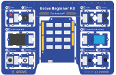

# Grove Beginner Kit for Arduino



## What it is

Arduino compatible board: Seeeduino Lotus (ATmega m328p).

Dimensions: 177 x 115 x 19 mm

Original Firmware code, which is pre-installed to the board, can be found [here](./Kit_Firmware/).

## Why

### STEAM education

* Science
* Technology
* Engineering
* Arts
* Mathematics

Steam education teaches innovation, to think critically and use engineering or technology in imaginative designs or creative approaches to real-world problems while building on students' mathematics and science base. If you like to build hardware then there is not much to do.

## Modules

All the modules have been connected to the MCU (microcontroller unit) through the PCB (printed circuit board) stamp holes. So no cables are needed to connect. Of course, you can also take the modules out and use cables.

[Schematics](./Schematics.md) (svg).

no |Name                           |Notes   |Interface|Pins/Address
---|-------------------------------|--------|---------|-------------
 1 |LED                            |Red     |Digital  |D4
 2 |Piezo Buzzer                   |        |Digital  |D5
 3 |OLED Display 0.96''            |SSD1315 |I2C      |0x78
 4 |Push Button                    |        |Digital  |D6
 5 |Potentsiometer                 |        |Analog   |A0
 6 |Light Sensor                   |        |Analog   |A6
 7 |Sound Sensor                   |        |Analog   |A2
 8 |Temperature and humidity sensor|DHT11   |Digital  |D3
 9 |3-Axis Accelerometer           |LIS3DHTR|I2C      |0x77, 0x76
10 |Air Pressure sensor            |BMP280  |I2C      |0x19

## Documentation

* [Grove Beginner Kit For Arduino.pdf](Doc/Grove-Beginner-Kit-For-Arduino.pdf) Arduino code
* [Codecraft Graphical Programming Course.pdf](Doc/Grove_Beginner_Kit_For_Arduino_Codecraft_Graphical_Programming_Course.pdf) Codecraft is based on the Scratch.

## PlatformIO settings

```Ini
[env:seeeduino]
platform = atmelavr
board = seeeduino
framework = arduino
monitor_speed = 115200
```

## Conclusion

If you are interested to learn embedded programming then this is a good starting point. All modules are already wired and it will make troubleshooting easier.
___
18.01.2022 Tauno Erik https://taunoerik.art
