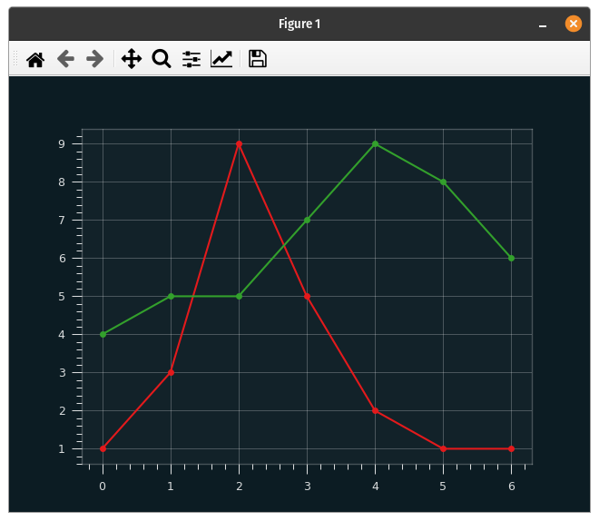
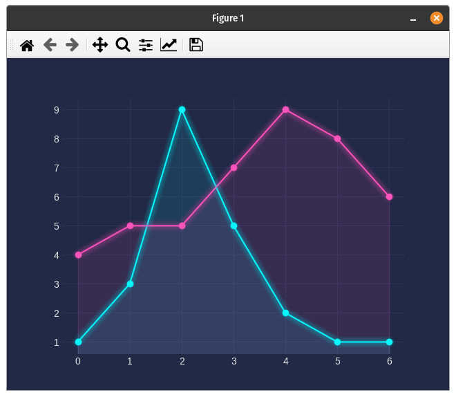

# Dark Matplotlib styles

## QB Styles



[github.com/quantumblacklabs/qbstyles](https://github.com/quantumblacklabs/qbstyles)

**Install**

```bash
pip install qbstyles
```

**Example**

```python
import matplotlib.pyplot as plt
from qbstyles import mpl_style

def plot(dark):
  mpl_style(dark)
    
  plt.plot([1, 3, 9, 5, 2, 1, 1], marker='o')
  plt.plot([4, 5, 5, 7, 9, 8, 6], marker='o')

  plt.show()

plot(dark=True)
```

## ing-theme-matplotlib


[pypi.org/project/ing-theme-matplotlib/](https://pypi.org/project/ing-theme-matplotlib/)

**Install**

```bash
pip install ing_theme_matplotlib
```

**Example**

```python
import matplotlib.pyplot as plt
from ing_theme_matplotlib import mpl_style

def plot(dark):
  mpl_style(dark)
    
  plt.plot([1, 3, 9, 5, 2, 1, 1], marker='o')
  plt.plot([4, 5, 5, 7, 9, 8, 6], marker='o')

  plt.show()

plot(dark=True)
```

## mplcyberpunk



[github.com/dhaitz/mplcyberpunk](https://github.com/dhaitz/mplcyberpunk)

**Install**

```bash
pip install mplcyberpunk
```

**Example**

```python
import matplotlib.pyplot as plt
import mplcyberpunk

def plot():
  plt.style.use("cyberpunk")
    
  plt.plot([1, 3, 9, 5, 2, 1, 1], marker='o')
  plt.plot([4, 5, 5, 7, 9, 8, 6], marker='o')

  mplcyberpunk.add_glow_effects()
  plt.show()

plot()
```

___
Tauno Erik | 04.02.2022 | [taunoerik.art](https://taunoerik.art)
